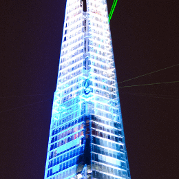
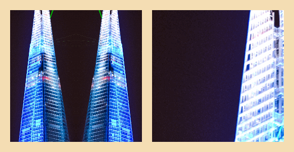
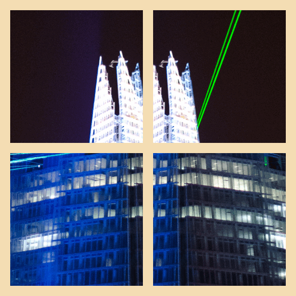
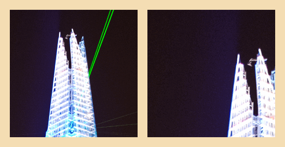

ofxTexturePlane
===============
This addon allows you to animate a repeating image texture inside a plane.

Loading an image
--
You can either pass in the filename of an image to load, or pass in an `ofImage` object.
```cpp
ofxTexturePlane plane;
plane.setup("filename.png");
```

Either approach works fine, but if you load the image yourself make sure to disble and re-enable ARB textures around your `ofImage.load`, because the addon [requires normalised texture coordinates](http://openframeworks.cc/documentation/gl/ofTexture/#show_ofEnableArbTex).

```cpp
ofxTexturePlane plane;

ofDisableArbTex();
image.load(filename);
ofEnableArbTex();

plane.setup(image);
```

Enabling ARB again straight after just reverts back to default OF behavior.

Simple example
--
There are three elements to think about: the window, the plane and the texture.

If you just call `setup("filename.png")` without any other arguments, the plane will by default stretch to fill the window, whatever size that may be. In the example below the window is 260 x 260 px and the plane has filled the window.

```cpp
//setup
ofxTexturePlane plane;
ofSetWindowShape(260, 260);
plane.setup("building.png");

//update & draw
plane.incrementTextureOffsetY(0.1);
plane.draw();
```



The plane doesn't move because the default `draw()` position is `(0, 0)`. However the image texture moves because `incrementTextureOffsetY(0.1)` is incrementing the texture offset by one-tenth each time `update()` is called.

Changing the scale
--
In the example above, the [image texture](example/bin/data/building.png) is 500px wide and 2000px tall. The smallest of those two dimensions is the width, at 500px.

Unless you specify otherwise, the image texture in the plane will be initialized to a scale of `1.0`. This means that the smaller dimension of the image texture, be it width or height, will be stretched or squeezed to fit perfectly inside the plane. The larger dimension will be stretched or squeezed so that the image texture retains it's original proportions.

You can override the scale using a `setup()` argument. To illustrate the different scales, this example shows how to draw two planes side-by-side, and to initialize the planes with custom dimensions.

```cpp
//setup
ofxTexturePlane plane1, plane2;
ofSetWindowShape(580, 300);
ofVec2f size = ofVec2f(260, 260);
plane1.setup("building.png", size, 0.5);
plane2.setup("building.png", size, 2.0);

//update
plane1.incrementTextureOffsetY(0.1);
plane2.incrementTextureOffsetY(0.1);

//draw
ofBackground(ofColor::wheat);
plane1.draw(20, 20);
plane2.draw(300, 20);
```



Changing the texture offset
--
In the examples above, the image texture offset setting is always set to the default `TEXTURE_OFFSET_TOP_LEFT`. However you can choose any of the [offset constants](/src/ofxTexturePlane.h) to automatically position the texture for you.

```cpp
//setup
ofxTexturePlane plane1, plane2, plane3, plane4;
ofSetWindowShape(580, 580);
ofVec2f size = ofVec2f(260, 260);
plane1.setup("building.png", size, 1.7, TEXTURE_OFFSET_TOP_LEFT);
plane2.setup("building.png", size, 1.7, TEXTURE_OFFSET_TOP_RIGHT);
plane3.setup("building.png", size, 1.7, TEXTURE_OFFSET_BOTTOM_RIGHT);
plane4.setup("building.png", size, 1.7, TEXTURE_OFFSET_BOTTOM_LEFT);

//draw
ofBackground(ofColor::wheat);
plane1.draw(20, 20);
plane2.draw(300, 20);
plane3.draw(300, 300);
plane4.draw(20, 300);
```



Note that there are many many [offset constants](/src/ofxTexturePlane.h), not just the four above. They are worth experimenting with.

Animating the scale or texture offset
--
Anything you set via `setup()` you can also set or increment later, to animate the texture on different frames. For example you can set or increment the texture offset using numerical arguments. Here are some random examples.

```cpp
plane.setTextureOffsetX(mouseX * 0.003); //set X only, based on mouse movement

plane.setTextureOffset(0.25, 0.75); //set both dimensions directly

plane.incrementTextureOffsetX(-0.003); //increment the texture toward the left

plane.incrementTextureOffset(0.003, 0.003); //increment the texture diagonally
```

You can also increment the texture scale each frame, creating the effect of a zoom.

(Note that all the `sign` variable is doing in `update()` below is switching between 1 and -1 every 10 frames. This is so that it increments by 0.1 each frame and then increments by -0.1 each frame, bouncing it back and forth).

```cpp
//setup
ofSetWindowShape(580, 300);
ofVec2f size = ofVec2f(260, 260);
plane1.setup("building.png", size, 1.0);
plane2.setup("building.png", size, 1.75);

//update
int sign = ((int)floor(ofGetFrameNum() * 0.1) % 2 == 0) ? 1 : -1;
plane1.incrementTextureScale(0.1 * sign);
plane2.incrementTextureScale(0.1 * sign);

//draw
ofBackground(ofColor::wheat);
plane1.draw(20, 20);
plane2.draw(300, 20);
```



Or you can just set the scale directly at any time.

```cpp 
//update
plane.setTextureScale(0.75);
```

Dependencies
------------
The addon has no dependencies. Tested against [openFrameworks 0.10.1](http://openframeworks.cc/download/).